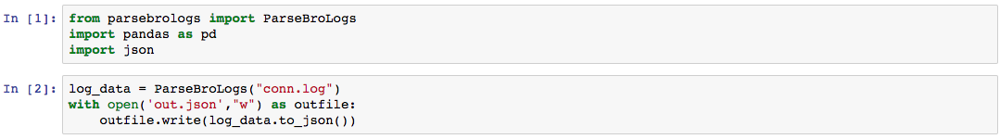
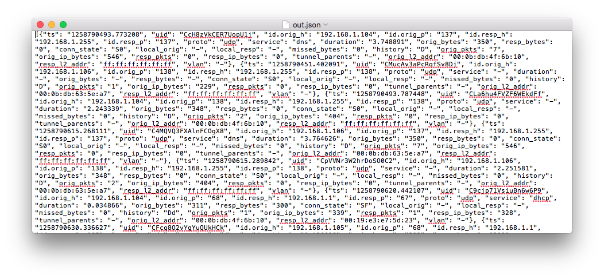
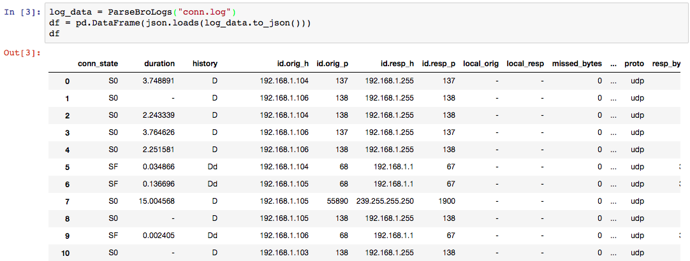
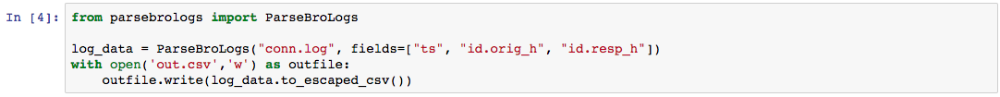
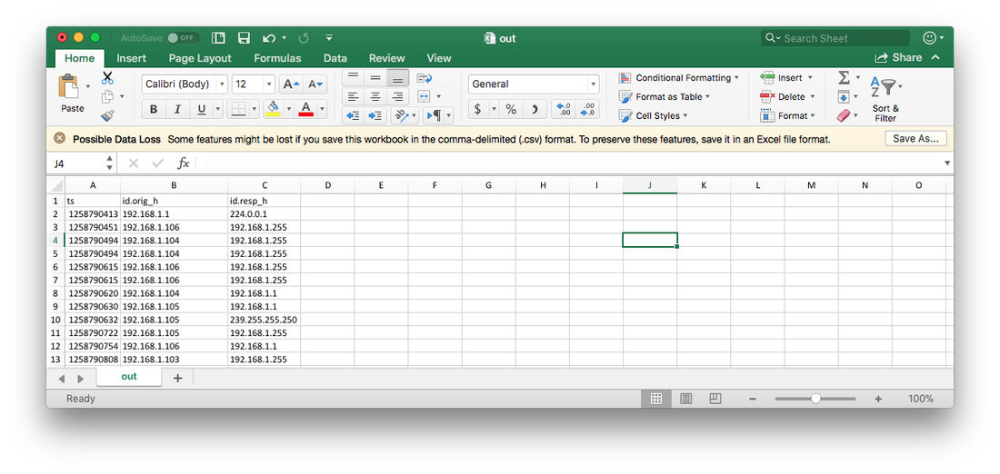

# Simplifying Bro IDS Log Parsing with ParseBroLogs

> **About this copy.** This post was first published on dgunter.com on
> 25 January 2018 at
> `https://dgunter.com/2018/01/25/simplifying-bro-ids-log-parsing-with-parsebrologs/`.
> The site is no longer online; the text and screenshots below were recovered
> from the
> [Wayback Machine snapshot of 10 July 2019](https://web.archive.org/web/20190710113217/https://dgunter.com/2018/01/25/simplifying-bro-ids-log-parsing-with-parsebrologs/)
> and are reproduced here by the author. The body is unchanged apart from
> formatting; the code examples, which were screenshots in the original, have
> been transcribed and the screenshots kept.
>
> The package was renamed from ParseBroLogs to ParseZeekLogs when Bro became
> Zeek, and version 3.0 replaced the `to_json()`/`to_csv()` methods with a
> typed record iterator. Where the post shows a 1.x call, a *3.0 note* gives
> the current equivalent; see the [README](../README.md) for the full API.

By: Dan Gunter

This week I pushed a Python package to pip to simplify parsing logs from the
Bro Intrusion Detection System. This package works on both Python 2 and
Python 3. You can use the following command to install the utility in your
environment:

```bash
pip install parsebrologs
```

Additional examples and the source code are available on
[GitHub](https://github.com/dgunter/ParseZeekLogs).

> **3.0 note.** The package is now `parsezeeklogs` and requires Python 3.10
> or newer:
>
> ```bash
> pip install parsezeeklogs
> ```

## Motivation

Recently I've been working on a few Python projects with friends that
required parsing and automated analysis of Bro IDS logs. After writing and
rewriting file parsers a few times, I figured the next logical step would be
to go ahead and develop a lightweight Python package instead of continuing to
reimplement the same code. I also wanted a library capable of replicating the
filtering features from bro-cut, and that could quickly present the data in
both Python and end user-friendly format.

## The Result

Parsebrologs is a Python package that doesn't require any external
dependencies outside the base python installation. Support for both Python 2
and Python 3 works right out of the box. A list of fields to filter down to
can emulate the functionality of the bro-cut utility. Data can be output in
CSV or JSON format. Overall these features covered the initial requires
defined initially. More features will be added as requested and anyone is also
welcome to send a pull request if you have any great ideas.

## How to Use

There are a few more nuanced features worth covering as we explore a few
examples. The first example we will show reads in the entire connection log
named conn.log and writes the data out to a file named out.json in JSON
format.

```python
from parsebrologs import ParseBroLogs
import pandas as pd
import json

log_data = ParseBroLogs("conn.log")
with open('out.json', "w") as outfile:
    outfile.write(log_data.to_json())
```





The to_json() method returns a string containing the JSON representation of
the data. The returned data is a list containing the individual JSON records.
The format of the returned JSON data is important to note if you want to load
the data into a pandas data frame or load the log data into a database like
Elasticsearch. To create a pandas data frame, you should convert the JSON
string back to a python object using the loads() method of the JSON library as
shown in the example below.

```python
log_data = ParseBroLogs("conn.log")
df = pd.DataFrame(json.loads(log_data.to_json()))
df
```



> **3.0 note.** Records are now yielded one at a time as typed dicts, so the
> JSON round trip is unnecessary and the DataFrame gets real numbers instead
> of strings:
>
> ```python
> import pandas as pd
> from parsezeeklogs import read_zeek, write_json_lines
>
> df = pd.DataFrame(read_zeek("conn.log"))
>
> with open("out.jsonl", "w") as outfile:          # one JSON object per line
>     write_json_lines(read_zeek("conn.log"), outfile)
> ```
>
> Or from the shell: `parsezeeklogs json conn.log -o out.jsonl`.

In addition to JSON, two methods are available to output data in CSV format.
The to_csv() method returns the data as an unescaped CSV formatted string
while the to_escaped_csv() method escapes all fields within the CSV. You
should use the to_escaped_csv() method if you plan on opening the CSV file
with Microsoft Excel or OpenOffice Calc. Escaping a CSV eliminates any issues
with commas or other special CSV characters. The CSV example also shows using
the fields variable to filter returned fields. The fields variable takes a
list of strings containing the requested fields values to return. The
ParseBroLog class instructor is where fields are specified.

```python
from parsebrologs import ParseBroLogs

log_data = ParseBroLogs("conn.log", fields=["ts", "id.orig_h", "id.resp_h"])
with open('out.csv', 'w') as outfile:
    outfile.write(log_data.to_escaped_csv())
```





> **3.0 note.** There is one CSV writer now and it always quotes correctly:
>
> ```python
> from parsezeeklogs import read_zeek, write_csv
>
> fields = ["ts", "id.orig_h", "id.resp_h"]
> with open("out.csv", "w", newline="") as outfile:
>     write_csv(read_zeek("conn.log", fields=fields), outfile, fields)
> ```
>
> Or from the shell: `parsezeeklogs csv conn.log -f ts,id.orig_h,id.resp_h -o out.csv`.

## Moving Forward

Hopefully, this library can serve as a successful building block for future
projects. As mentioned earlier, if you have a great idea send it my way or
feel free to submit a pull request. If you have any feedback or success
stories to share, you can also reach me on twitter (@dan_gunter) or via gmail
(dangunter).

---

*The library went on to be used in the* Threat Hunting with Python *series:
[part 2, detecting Nmap behaviour with Bro HTTP logs](https://www.dragos.com/blog/threat-hunting-with-python-part-2-detecting-nmap-behavior-with-bro-http-logs)
(Dragos, still online),
[part 3, taming SMB](https://web.archive.org/web/20190716204520/https://dgunter.com/2018/02/17/threat-hunting-with-python-and-bro-ids-part-3-taming-smb/)
and
[part 4, examining Microsoft SQL based historian traffic](https://web.archive.org/web/20190711052703/https://dgunter.com/2018/03/20/threat-hunting-with-python-part-4-examining-microsoft-sql-based-historian-traffic/)
(archived). The notebooks are in
[dgunter/Blog-Code](https://github.com/dgunter/Blog-Code).*
